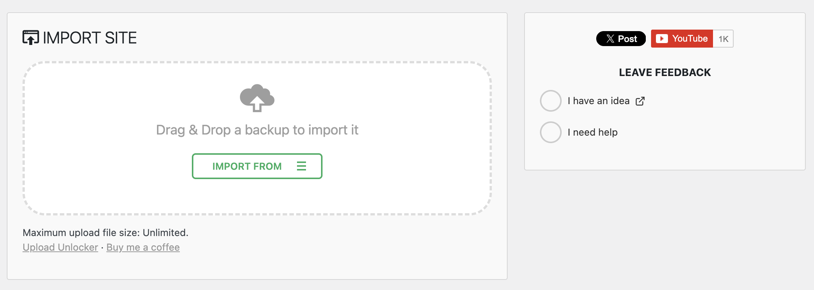

# Upload Unlocker for All in All Migration

Removes the upload file-size restriction on [All-in-One WP Migration](https://wordpress.org/plugins/all-in-one-wp-migration/) imports, enables one-click backup restore, and raises PHP runtime limits. No core files are modified.



## What It Does

| Feature | How |
|---|---|
| **Unlimited import size** | Removes the client-side file-size gate that blocks large `.wpress` uploads |
| **One-click backup restore** | The "Restore" button on the Backups page just works |
| **Higher PHP memory** | Calls `wp_raise_memory_limit()` on migration screens |
| **Clean UI** | Replaces the upsell notice with a simple "Unlimited" confirmation |
| **Hides promo menus** | Removes the "Schedules" and "Reset Hub" upsell submenus |

## How It Works

All-in-One WP Migration already uploads files in **5 MB chunks**, so any server can handle that. The only thing stopping large imports is a JavaScript check that compares the *total* file size against the server's reported limit. This plugin removes that check using standard WordPress hooks:

- `upload_size_limit` filter
- `wp_add_inline_script()`
- `wp_raise_memory_limit()`

No migration plugin files are touched. Everything is scoped to migration admin screens only.

## Requirements

- WordPress 5.0+
- PHP 7.4+
- [All-in-One WP Migration](https://wordpress.org/plugins/all-in-one-wp-migration/) (free version) installed and active

## Installation

### As a Plugin

1. Download the [latest release](https://github.com/shameemreza/upload-unlocker-for-aiam/releases).
2. Upload the `upload-unlocker-for-aiam` folder to `/wp-content/plugins/`.
3. Activate **Upload Unlocker for All in All Migration** from the Plugins screen.
4. Go to **All-in-One WP Migration > Import** and the file size limit is gone.

### As a Code Snippet

If you prefer not to install a plugin, add this to your theme's `functions.php` or use a code-snippets plugin like [SnipDrop](https://github.com/shameemreza/snipdrop):

<details>
<summary>Show snippet</summary>

```php
// Raise the WordPress-reported upload limit on migration pages.
add_filter( 'upload_size_limit', function ( $limit ) {
    $page = isset( $_GET['page'] ) ? sanitize_text_field( wp_unslash( $_GET['page'] ) ) : '';
    if ( str_starts_with( $page, 'ai1wm_' ) ) {
        return 9007199254740991; // Effectively unlimited
    }
    return $limit;
} );

// Replace the upsell text with a simple confirmation.
add_filter( 'ai1wm_pro', function () {
    return '<p class="max-upload-size">Maximum upload file size: Unlimited.</p>';
}, 20 );

// Override the client-side file-size gate and enable backup restore.
add_action( 'admin_enqueue_scripts', function () {
    if ( wp_script_is( 'ai1wm_import', 'enqueued' ) || wp_script_is( 'ai1wm_import', 'registered' ) ) {
        wp_add_inline_script(
            'ai1wm_import',
            'if(typeof ai1wm_uploader!=="undefined"){ai1wm_uploader.max_file_size=Math.max(ai1wm_uploader.max_file_size,9007199254740991);}',
            'after'
        );
    }
    if ( wp_script_is( 'ai1wm_backups', 'enqueued' ) || wp_script_is( 'ai1wm_backups', 'registered' ) ) {
        $js = '(function(){if(typeof Ai1wm==="undefined"||typeof Ai1wm.Import==="undefined")return;'
            . 'Ai1wm.FreeExtensionRestore=function(a,s){'
            . 'var m=new Ai1wm.Import();'
            . 'm.setParams([{name:"storage",value:Date.now().toString()},{name:"archive",value:a},{name:"ai1wm_manual_restore",value:"1"}]);'
            . 'm.start([{name:"priority",value:10}]);};})();';
        wp_add_inline_script( 'ai1wm_backups', $js, 'after' );
    }
}, 99 );

// Raise PHP memory limit on migration pages.
add_action( 'admin_init', function () {
    $page = isset( $_GET['page'] ) ? sanitize_text_field( wp_unslash( $_GET['page'] ) ) : '';
    if ( str_starts_with( $page, 'ai1wm_' ) ) {
        wp_raise_memory_limit( 'admin' );
    }
} );
```

</details>

## FAQ

**Will this work if my hosting has a low `upload_max_filesize`?**

Yes. All-in-One WP Migration splits every file into 5 MB chunks, so each HTTP request stays well within typical PHP limits. The only thing blocking large imports was a JavaScript check, and this plugin removes it.

**Do I still need to change php.ini or .htaccess?**

Usually not. Since uploads happen in 5 MB chunks, `upload_max_filesize` and `post_max_size` only need to be above 5 MB, which almost every host already has. If your host is unusually restrictive, see the [readme.txt](readme.txt) for manual overrides.

## Support

- [Report an issue](https://github.com/shameemreza/upload-unlocker-for-aiam/issues)
- [Buy me a coffee](https://ko-fi.com/shameemreza)

## License

GPL-2.0-or-later. See [LICENSE](LICENSE) for details.
